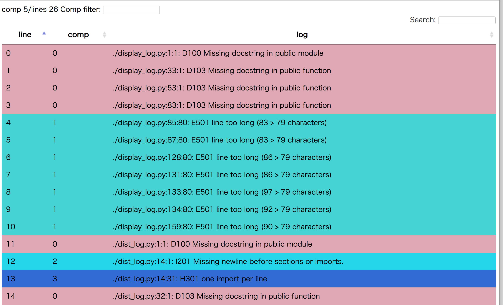

log2html
=========

Clustering log lines with difflib.SequenceMatcher as similarity measure,
display result as html table

Result 
------


Example1: clustering flake8 issues
----------------------------------

```
find . -name '*.py' | xargs flake8 | ./display_log.py -
```

Example2: clustering apache log
----------------------------------

```
./display_log.py /var/log/apache/error_log*
```

Example3: clustering adb log
-----------------------------
* TODO: write


Distributed analysis
----------------------
* dist_log.py


TODO
-----
* add clickable histgram of each comp
  * http://bl.ocks.org/KatiRG/5f168b5c884b1f9c36a5

----
Takashi Masuyama < mamewotoko@gmail.com >  
http://mamewo.ddo.jp/

